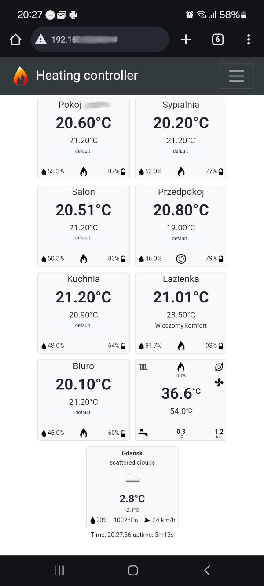

# OpenThermostat for ESP32

An open thermostat project enabling control of a central heating boiler and up to 8 separate heating circuits.

OpenThermostat can control the boiler using an ON/OFF relay or directly via the EMS2 protocol (e.g., via the EMS interface board from [EMS Interface Board](https://bbqkees-electronics.nl/product/ems-interface-board-v3-1/)).

## Features:

- Remote temperature reading of rooms via Bluetooth from Xiaomi thermometers (displaying temperature, battery status, and humidity)
- Configuration and access through WIFI - web interface
- Support for battery-powered real-time clock
- NTP time synchronization
- Sending status and temperature via MQTT
- Integration with Home Assistant
- Can work with any boiler as a simple ON/OFF thermostat
- Compatible with EMS2 compliant boilers
- Ability to read external temperature from EMS2 boilers
- Ability to read external temperature from the internet using OpenWeather data (weather display on web interface)
- Displaying the status of EMS2 boilers, such as operating mode, temperatures, system pressure, etc.
- Ability to freely configure the heating curve for EMS2 compliant boilers
- Ability to configure any number of programs
- Ability to set room temperatures with an accuracy of 0.1°C
- Ability to override the basic configuration for a circuit (room) at any time for any selected days of the week
- Ability to forward EMS2 packets (allows connection of a second EMS32 board with EMS-ESP32)
- REST API

## Disclaimer

This project is provided "as is" without any guarantees or warranty. In association with the product, the developer makes no warranties of any kind, either express or implied, including but not limited to warranties of merchantability, fitness for a particular purpose, of title, or of noninfringement of third party rights. Use of the product by a user is at the user’s risk. In no event shall the developer be liable for any damages, including but not limited to direct, indirect, special, incidental, or consequential damages, losses, or expenses arising in connection with the use of this project.

## ⚠️ Safety Note

**WARNING: This device operates at high voltage (110V / 230V)**

This thermostat is an project that operates at high voltages, including 110V or 230V. The system includes components such as a power supply, relays, and valve actuators, which can pose a risk to health and life if improperly installed or used.

**WARNING: Installation and operation of this device should only be performed by individuals with the appropriate qualifications and certifications, in accordance with the regulations applicable in their country.**

The creators of this project disclaim all responsibility for any damages, injuries, material losses, or other consequences resulting from improper use, installation, or maintenance of the device. The user assumes full responsibility for complying with local regulations regarding the operation of electrical devices. This includes, but is not limited to, any potential damage to heating systems, such as boilers, resulting from incorrect use or installation.

**Recommendations:**
1. Ensure that the power supply is disconnected before starting the installation.
2. Always follow local electrical codes and the manufacturer's recommendations.
3. Consult a qualified electrician if you have any doubts regarding the installation or operation of the device.

Failure to follow these recommendations may result in serious injury or death. Installation and use of the device are at the user’s own risk.
Depending on the method chosen for implementing the hardware part, the project may require working with high voltages, such as 230V. This requires proper qualifications and adherence to regulations in the respective country.
