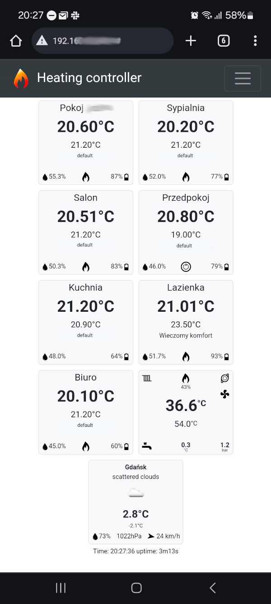

# OpenThermostat for ESP32

An open thermostat project enabling control of a central heating boiler and up to 8 separate heating circuits.



OpenThermostat can control the boiler using an ON/OFF relay or directly via the EMS2 protocol (e.g., via the EMS interface board from [EMS Interface Board](https://bbqkees-electronics.nl/product/ems-interface-board-v3-1/)).

## Features:

- Remote temperature reading of rooms via Bluetooth from Xiaomi thermometers (displaying temperature, battery status, and humidity)
- Configuration and access through WIFI - web interface
- Support for battery-powered real-time clock
- NTP time synchronization
- Sending status and temperature via MQTT
- Integration with Home Assistant
- Can work with any boiler as a simple ON/OFF thermostat
- Compatible with EMS2 compliant boilers
- Ability to read external temperature from EMS2 boilers
- Ability to read external temperature from the internet using OpenWeather data (weather display on web interface)
- Displaying the status of EMS2 boilers, such as operating mode, temperatures, system pressure, etc.
- Ability to freely configure the heating curve for EMS2 compliant boilers
- Ability to configure any number of programs
- Ability to set room temperatures with an accuracy of 0.1°C
- Ability to override the basic configuration for a circuit (room) at any time for any selected days of the week
- Ability to forward EMS2 packets (allows connection of a second EMS32 board with EMS-ESP32)
- REST API

## Home Assistant climate panels

Copy `ha/config/custom_components/open_thermostat` to the `custom_components` directory in your Home Assistant configuration and restart Home Assistant. With the MQTT integration enabled, Home Assistant should discover **OpenThermostat** from the existing `<MQTT base>/room_data` messages. Confirm the discovered integration once; it will then add room entities as rooms appear. You can also add the integration manually and enter the MQTT base configured in the thermostat (`ib-therm` in this project's configuration).

The **OpenThermostat** integration contains a main device with memory, uptime, boiler energy, water usage, and outdoor temperature sensors, plus one thermostat device per room. Each room device contains a climate entity and sensors for current temperature, temperature set by the program, humidity, battery, program name, heating enabled, and heating activity when the thermostat reports those values. Room devices are named `OpenThermostat — <room name>` so their generated entity IDs remain distinguishable from unrelated devices in the same room. Temperature set, battery level, and program name are also available as attributes of the climate entity. Room entities use the permanent ID from `rooms.json`; messages without room IDs are ignored.

The firmware setting **Publish Home Assistant MQTT Discovery** controls whether the thermostat also creates standard MQTT entities. Leave it disabled when using the custom integration to avoid duplicate readings. MQTT state topics continue to be published when Discovery is disabled, so the custom integration keeps working. Enable it when the thermostat should integrate with Home Assistant without the custom integration. Configuration files that predate this setting retain the previous behavior and publish Discovery.

The integration includes light and dark brand images in `brand/`. Home Assistant 2026.3 or newer loads them directly from the custom integration directory, so copy the complete `open_thermostat` directory when updating it.

During setup, you can choose to create a separate **OpenThermostat** dashboard in the HA sidebar. For an integration already installed, open **Settings → Devices & services → OpenThermostat → Configure** and enable **Create an OpenThermostat dashboard**. Its first view contains a standard thermostat card for each room reported over MQTT. The second view contains separate device diagnostics and EMS information cards. The EMS card includes energy, water, temperatures, pressure, burner power, boiler display and service codes, plus the available burner, pump, fan, heating, hot-water, siphon-filling and venting states. These entities remain visible as unavailable when the thermostat has no current reading. View titles follow the Home Assistant language for Polish and English installations. The integration updates the dashboard when rooms or entity IDs change and removes the sidebar panel when the option is disabled. It manages the contents of this dashboard, so edits to its cards can be replaced by the next update. Other HA dashboards are untouched.

Changing the target temperature in an HA climate panel creates a temporary override on the thermostat. Each room has a **Temperature override duration** number entity (10–720 minutes, default 120) that controls the next change. HA sends a non-retained JSON command to `<MQTT base>/command/temporary` with `requestId`, `roomName`, `temperature` in hundredths of a degree Celsius, and `validSeconds`. New firmware validates the command, applies the override, replies on `<MQTT base>/response/temporary`, and immediately publishes updated `room_data`. HA reports an error if the thermostat rejects the command or does not reply within 10 seconds. The thermostat's program configuration remains unchanged. Upload the new firmware before using this control from HA.

The climate `hvac_action` uses the same condition as the thermostat web UI's flame icon: `shouldContinueHeating` for that room and `boilerStarted` for the boiler. New firmware publishes `boilerStarted` in `room_data`; with older firmware the climate entity falls back to `isBeingHeated`. The separate **Heating** binary sensor keeps the thermostat's original `isBeingHeatedState` value, based on the boiler and the room valve. The optional dashboard shows the current temperature below the target temperature on each thermostat card. For a manually created dashboard, use this card configuration (the climate details popup uses a different layout):

```yaml
type: thermostat
entity: climate.openthermostat_biuro
show_current_as_primary: false
```

The `room_data` MQTT message includes each room's `currentProgram` and `temporaryProgramSecondsLeft`. New firmware also publishes `activeProgram` at the top level. The integration displays a temporary override first, then a room-specific program, then the active main program. Upload the new firmware to make the main program available for rooms without a room-specific program.

For low battery alerts, copy `ha/config/custom_components/open_thermostat/blueprints/low_battery.yaml` to `<HA config>/blueprints/automation/open_thermostat/low_battery.yaml`. In **Settings → Automations & scenes → Blueprints**, create an automation from **OpenThermostat - low room battery**. Select the room battery sensors, set the percentage threshold, and choose the notification action. The default action creates a persistent HA notification; it can be replaced with a mobile notification action. The blueprint ignores `-1` (no battery reading) and alerts when a valid level first falls below the threshold or returns low after an unavailable reading. Home Assistant does not load blueprints directly from `custom_components`.

## Room and program configuration

Rooms and heating programs are stored separately. `data/cfg/rooms.json` contains each room's permanent eight-character ID, name, temperature sensor and valves. Files in `data/programs` refer to rooms by `room_id` and contain only heating settings. Programs do not share room settings with one another.

The web interface provides separate **Rooms** and **Programs** tabs and separate save buttons. Creating a room generates its permanent ID. Renaming or reordering the room does not change that ID. A program can only add settings for a room that already exists in the room catalog.

This firmware only supports the separated format. Build and upload the filesystem from the versioned `data` directory together with the firmware. For PlatformIO, use `pio run -e <environment> -t buildfs` followed by the matching filesystem upload command. Uploading the firmware without the new filesystem leaves heating disabled because `/cfg/rooms.json` is required.

## Filesystem OTA

The ESP32-S3 partition table contains two equal SPIFFS slots. A filesystem OTA update is written sector by sector to the inactive slot while the current slot remains mounted. The firmware checks the complete byte count, mounts the uploaded image, verifies required UI and configuration files, and only then records the new slot in NVS for the next reboot. If the selected slot cannot be mounted during startup, the firmware automatically falls back to the other slot.

The classic 4 MB ESP32 keeps one SPIFFS partition because there is not enough flash for two useful slots. It uses the same incremental erase, size checks, and filesystem validation, but an interrupted upload can still damage its only filesystem. The firmware provides a dependency-free recovery page at `/recovery`; when SPIFFS cannot be mounted, `/` displays that page as well.

Moving an existing ESP32-S3 installation from the old single SPIFFS partition to the dual-slot layout requires one USB deployment because application OTA does not update the partition table:

```bash
pio run -e esp32s3 -t upload
pio run -e esp32s3 -t uploadfs
```

After that migration, filesystem updates can use the web UI. Always upload the `spiffs.bin` built for the same hardware environment. The server requires the image size to match its target partition exactly: 589,824 bytes for `esp32dev` and 4,653,056 bytes for the dual-slot `esp32s3` layout.

The firmware publishes room IDs in `room_data`, and the custom Home Assistant integration uses them as stable device and entity identities.

MQTT Discovery also uses the permanent room ID instead of the room's array position. For example, with MQTT base `ib-therm`, room ID `d29a8f11` produces `sensor.ib_therm_d29a8f11_current_temperature`. The MQTT base is sanitized only where Home Assistant requires an entity ID (`ib-therm` becomes `ib_therm`); MQTT topics and unique IDs continue to use the configured value.

After upgrading from index-based Discovery, inspect the retained messages that belong to the old OpenThermostat configuration:

```bash
./tools/cleanup_open_thermostat_mqtt.sh MQTT_BROKER_HOST MQTT_BASE
```

Run the command again with `--execute` before the host to clear the listed retained messages, then restart the thermostat so it publishes the current Discovery configuration. The script accepts `MQTT_PORT`, `MQTT_USERNAME`, and `MQTT_PASSWORD` through the environment. It does not modify the Home Assistant entity registry or recorder history.

## Disclaimer

This project is provided "as is" without any guarantees or warranty. In association with the product, the developer makes no warranties of any kind, either express or implied, including but not limited to warranties of merchantability, fitness for a particular purpose, of title, or of noninfringement of third party rights. Use of the product by a user is at the user’s risk. In no event shall the developer be liable for any damages, including but not limited to direct, indirect, special, incidental, or consequential damages, losses, or expenses arising in connection with the use of this project.

## ⚠️ Safety Note

**WARNING: This device operates at high voltage (110V / 230V)**

This thermostat is an project that operates at high voltages, including 110V or 230V. The system includes components such as a power supply, relays, and valve actuators, which can pose a risk to health and life if improperly installed or used.

**WARNING: Installation and operation of this device should only be performed by individuals with the appropriate qualifications and certifications, in accordance with the regulations applicable in their country.**

The creators of this project disclaim all responsibility for any damages, injuries, material losses, or other consequences resulting from improper use, installation, or maintenance of the device. The user assumes full responsibility for complying with local regulations regarding the operation of electrical devices. This includes, but is not limited to, any potential damage to heating systems, such as boilers, resulting from incorrect use or installation.

**Recommendations:**
1. Ensure that the power supply is disconnected before starting the installation.
2. Always follow local electrical codes and the manufacturer's recommendations.
3. Consult a qualified electrician if you have any doubts regarding the installation or operation of the device.

Failure to follow these recommendations may result in serious injury or death. Installation and use of the device are at the user’s own risk.
Depending on the method chosen for implementing the hardware part, the project may require working with high voltages, such as 230V. This requires proper qualifications and adherence to regulations in the respective country.
