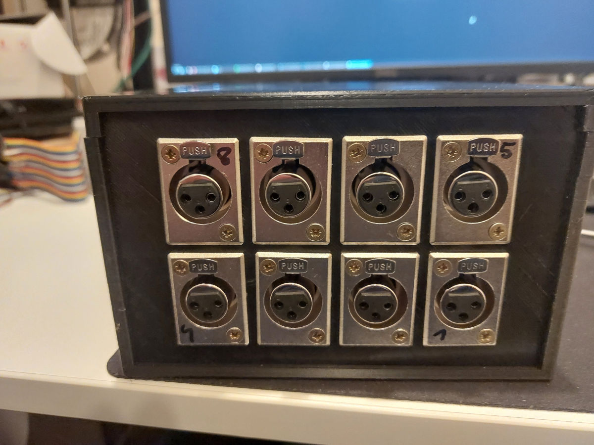
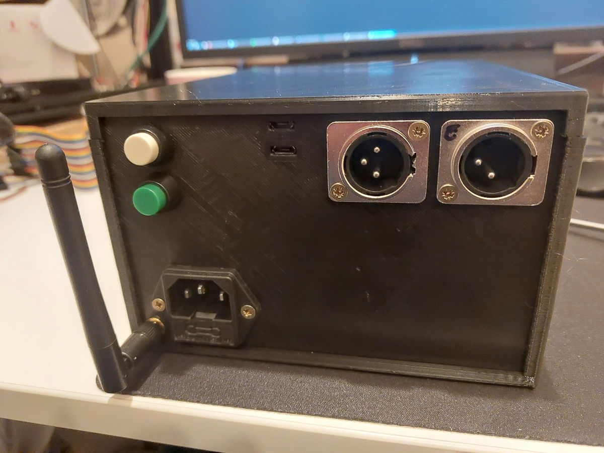
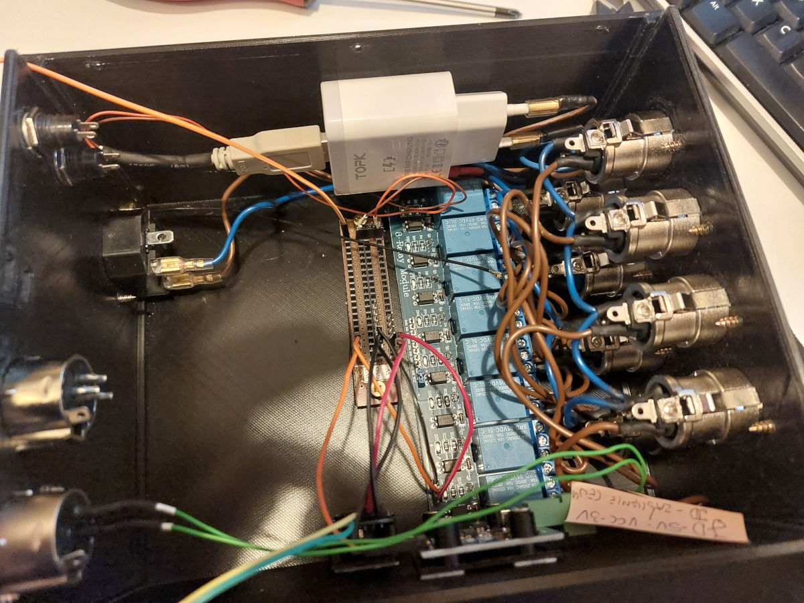

In building my project, I used the following components:

- [EMS interface board v3.1 from BBQKEES](https://bbqkees-electronics.nl/product/ems-interface-board-v3-1/)
- Relay board with optical isolation, capable of being controlled by 3.3V
- ESP32 development board, two units, the second one for handling [EMS-ESP32](https://github.com/emsesp/EMS-ESP32)
- RTC clock module
- Phone charger as the cheapest 230V->5V converter
- Microphone sockets and plugs - for powering the actuators
- Microphone sockets and plugs - for connecting the EMS boiler and outside temperature sensor
- Power socket (computer type) with a 1A fuse
- External WIFI/BT antenna - for increased range
- 3D printed enclosure
- Herz thermal actuators powered by 230V, normally open

